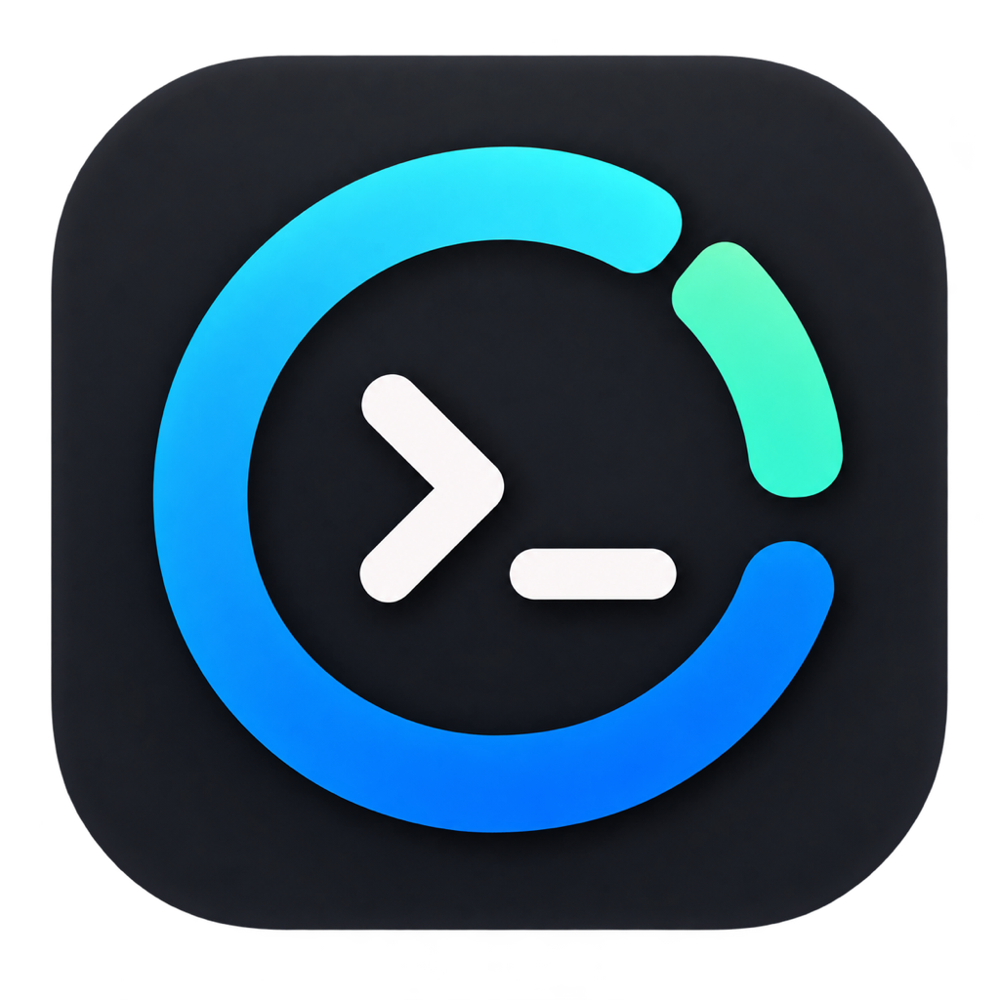
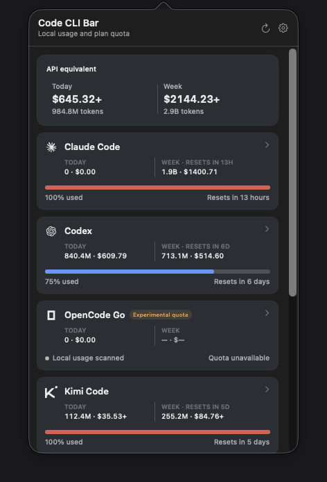

<p align="center">
  
</p>

<h1 align="center">Code CLI Bar</h1>

<p align="center">
  <strong>Your coding-agent usage, plan headroom, and API-equivalent cost — one click away.</strong><br>
  A focused, local-first macOS menu bar app for people who work across several coding CLIs.
</p>

<p align="center">
  <a href="https://github.com/lifeodyssey/code-cli-bar/actions/workflows/ci.yml"></a>
  <a href="https://github.com/lifeodyssey/code-cli-bar/actions/workflows/release.yml"></a>
  
  
  
  <a href="LICENSE"></a>
</p>

<p align="center">
  <picture>
    <source media="(prefers-color-scheme: dark)" srcset="docs/screenshots/code-cli-bar-popover-dark.png">
    <source media="(prefers-color-scheme: light)" srcset="docs/screenshots/code-cli-bar-popover-light.png">
    
  </picture>
</p>

<p align="center"><sub>The production popover, captured from a scrubbed synthetic home. No account or project data is shown.</sub></p>

Code CLI Bar is deliberately smaller than an analytics dashboard. It answers
three questions quickly:

1. How much did my local coding CLIs use today?
2. How much have they used since each provider's current weekly plan cycle began?
3. What would the priced portion of those tokens have cost at public API rates?

## One click, four signals

| Signal | What it means | Where it comes from |
| --- | --- | --- |
| **Today** | Tokens and API-equivalent cost since local midnight | CLI session logs and local databases |
| **Week** | Usage since the provider's active weekly quota cycle began | Provider reset metadata + the local usage ledger |
| **Plan quota** | Used percentage and the next reset | Provider API or provider-authored local cache |
| **Actual cash** | Optional subscriptions, credits, and overages | A separate ledger you enter manually |

Today and Week are intentionally fixed concepts. Week is not a rolling seven
days: it starts at `next reset − provider window length`. If a provider does
not expose a trustworthy reset, the app leaves that Week value unavailable.

> [!IMPORTANT]
> A stale quota refresh no longer erases a still-active plan cycle. Code CLI
> Bar keeps only last-known buckets whose provider reset is still in the
> future, marks them as stale, and keeps retrying. Expired cycles and
> implausibly future-dated caches are rejected.

## Six CLIs, one compact view

| CLI | Default local source | Plan quota |
| --- | --- | --- |
| **Claude Code** | `~/.claude/projects` | Claude Code first, then OAuth and explicit Web fallback |
| **Codex** | `~/.codex/sessions` | CLI/OAuth account quota |
| **OpenCode Go** | `~/.local/share/opencode/opencode.db` | Native Go-plan quota, experimental opt-in |
| **Kimi Code** | `~/.kimi-code/sessions` | Available with compatible credentials |
| **ZCode** | `~/.zcode/cli/db/db.sqlite` | Experimental opt-in |
| **Grok Build** | `~/.grok/sessions` | CLI or explicitly imported browser credentials |

Each provider can be disabled or pointed at a custom path. Local usage and
remote quota are separate: finding a CLI history does not imply that its
account quota is available.

Kimi Code owns its CLI login renewal. The quota monitor reads the current
credential without refreshing or writing it; if it expires, open Kimi Code
to renew the login and refresh quota again. This avoids competing with the
CLI for its shared OAuth refresh token.

## Money without pretending it is a bill

The headline dollar value is an **API-equivalent estimate**, not an invoice.

- A provider-recorded request cost wins when the local store includes one.
- Otherwise, input, output, and cache tokens use the verified model price table.
- Unknown model rates are not silently treated as free. `$12.34+` means a
  priced floor with additional unpriced requests; `$—` means no selected
  request has a verified price.
- Subscription payments never get mixed into that estimate. They appear only
  in the optional Actual cash ledger.

Pricing changes, model aliases, and provider-side metering make this an honest
approximation rather than accounting-grade billing.

## Trust boundaries

- Usage history is read in place; provider logs are never edited.
- Derived usage, quota caches, and settings stay under `~/.code-cli-bar`.
- Prompt text, response text, tool-call content, project paths, and raw request
  identifiers are excluded from the persisted usage ledger.
- Opt-in browser credentials are stored through macOS Keychain-backed stores.
- There is no telemetry and no cloud sync.
- The screenshot workflow uses a generated demo home that rewrites account,
  machine, session, request, and project identifiers before capture.

## Build it

Reviewed builds appear on [GitHub Releases](https://github.com/lifeodyssey/code-cli-bar/releases).
Every release includes an architecture-labelled ZIP and SHA-256 checksum. The
tag-driven workflow creates a draft first, so its generated notes and artifacts
can be inspected before publication. Until Apple Developer credentials are
configured, those downloads are ad-hoc signed and macOS requires a one-time
right-click → **Open** confirmation. Version history is recorded in
[CHANGELOG.md](CHANGELOG.md).

Requirements: macOS 26+, Xcode 26, and Swift 6.2.

```bash
git clone https://github.com/lifeodyssey/code-cli-bar.git
cd code-cli-bar
DEVELOPER_DIR=/Applications/Xcode.app/Contents/Developer swift test
DEVELOPER_DIR=/Applications/Xcode.app/Contents/Developer ./Scripts/build_app.sh release
open ".build/Code CLI Bar.app"
```

The local build is ad-hoc signed. Public distribution still requires a
Developer ID signature, notarization, and a signed Sparkle update feed. Code
CLI Bar is an `LSUIElement` accessory app, so it lives in the menu bar without
a Dock icon.

## Settings and files

Use the gear button to choose providers, custom paths, refresh intervals,
credential imports, experimental quota adapters, Actual cash entries, or a
previewed import of compatible history from `~/.vibebar`.

Removing the app bundle does not remove `~/.code-cli-bar`. The legacy importer
also never rewrites or deletes its source.

Code CLI Bar began from [AstroQore/Vibe Bar](https://github.com/AstroQore/vibe-bar)
and now maintains a deliberately narrower product surface. It is not affiliated
with Anthropic, OpenAI, SST/OpenCode, Moonshot AI, Zhipu AI, or xAI. Third-party
acknowledgements are recorded in
[THIRD_PARTY_NOTICES.md](THIRD_PARTY_NOTICES.md).
